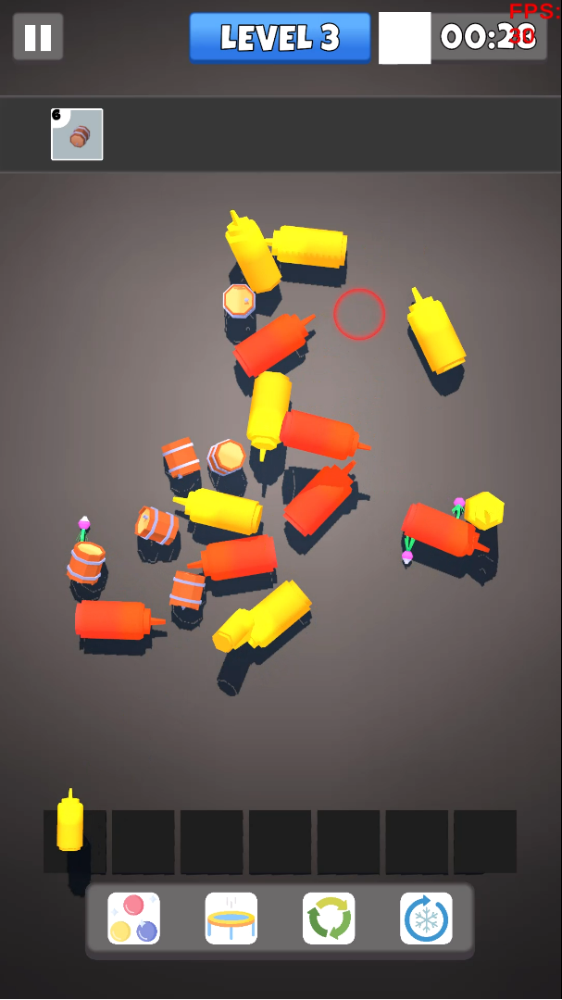
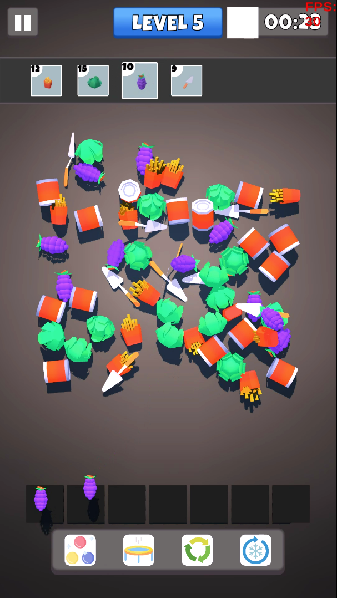
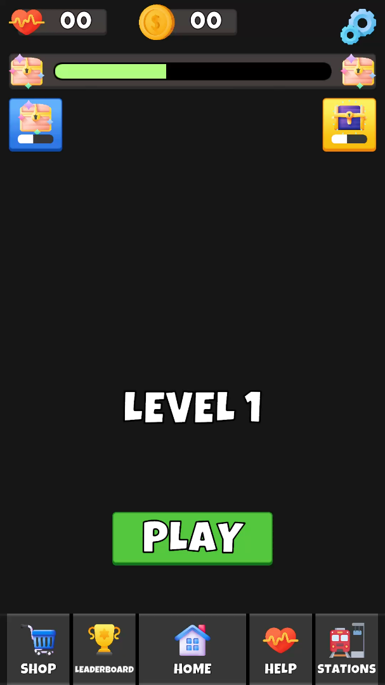

# Match Station

## Overview

**Match Station** is an engaging Match-3 puzzle game where players match and collect specific items across various levels. The objective is to find and match three identical items from a grid of randomly scattered objects, focusing on collecting certain required item types to succeed.

## Gameplay

In **Match Station**, players are challenged to match three identical items from a grid. Each level specifies particular item types that must be collected, and the game features 7 tiles where collected items are displayed. Players must match items to fill these tiles, and failing to do so results in a level failure. Successfully collecting all required items allows progression to the next level.

- **Match-3 Mechanics**: Match three identical items to collect them.
- **Tile-based System**: Display and manage collected items on 7 tiles.
- **Level Objectives**: Collect specific items to complete each level.
- **Randomized Layout**: Items are randomly distributed at the start of each level.
- **Failure & Success Conditions**: Fail if no matches are possible and succeed by meeting the collection goals.

## Gameplay Video

[](https://youtu.be/-yNsxpZrWdg)

## Screenshots

|  |  |  |
|:------------------------------------:|:------------------------------------:|:------------------------------------:|

## Technologies

- **Unity Engine**: Utilized for the game development environment.
- **C# Programming**: Implemented with SOLID principles and OOP for high performance and code readability.
- **DOTween**: Used for smooth animations and transitions.

  
## Custom Tools

- **ItemCreator Tool**: A custom Unity Editor tool developed to convert FBX models into item prefabs for seamless game integration. This tool simplifies the process of creating and configuring item prefabs for use in the game by automating tasks such as setting item IDs, icons, and descriptions. It also allows developers to quickly assign and preview these prefabs within the Unity Editor, improving the workflow for adding new items to the game.

### ItemCreator Tutorial Video

[](https://www.youtube.com/watch?v=3M8tVMEeeug)

## Assets

- **3D Models**: Leveraged assets from [Kenney's Food Kit](https://kenney.nl/assets/food-kit).

## Installation

1. Clone the repository:
   ```bash
   git clone https://github.com/yourusername/match-station.git
